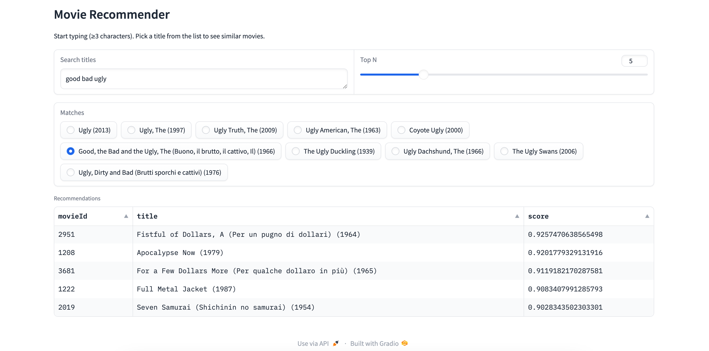

# Movie Recommendation System (MovieLens)

A hybrid movie recommender system built with Truncated SVD, genre features, and cosine k-NN, designed for the [MovieLens 25M dataset](https://grouplens.org/datasets/movielens/25m/).

Includes:
- A clean, modular Python implementation (`src/recommender.py`)
- A Gradio web app for interactive exploration
- TF-IDF title search + fuzzy matching

---

## Features

- Filters out inactive movies/users (configurable thresholds)
- Learns latent movie embeddings with Truncated SVD
- Adds genre one-hot vectors with adjustable weight
- Computes similar movies using cosine similarity
- Provides title search with TF-IDF + fuzzy matching
- Simple Gradio interface to explore recommendations

---

## Setup & Run

Run these commands from your terminal in the project root:

```
# 1. Clone the repo
git clone https://github.com/2sahil/Movie-Recommendation-System.git
cd Movie-Recommendation-System

# 2. Create & activate a virtual environment
python3 -m venv .venv
source .venv/bin/activate        # Windows (PowerShell): .\.venv\Scripts\Activate.ps1

# 3. Upgrade base tools (recommended)
pip install -U pip setuptools wheel

# 4. Install dependencies
pip install -r requirements.txt

# 5. Run the app
python app.py
``` 

When python app.py runs successfully, Gradio will open local URL (in this app, http://127.0.0.1:7860).

---

### Data Setup

Download ratings.csv and movies.csv from MovieLens 25M, then place them in a data/ folder in the project root:
```
Movie-Recommendation-System/
├── app.py
├── src/
│   └── recommender.py
└── data/
    ├── ratings.csv
    └── movies.csv
```

    ---

### Quick Test (Optional)

To quickly check that the recommender works without starting the UI:
```
python - <<'PY'
from src.recommender import HybridRecommender
r = HybridRecommender().fit("data/ratings.csv", "data/movies.csv")
print(r.recommend("The Godfather", top_n=5))
PY
```

---

## License & Data
This project uses the publicly available MovieLens 25M dataset, which is not redistributed here — please download it from the official site. https://grouplens.org/datasets/movielens/25m/https://grouplens.org/datasets/movielens/25m/

---

## Preview


